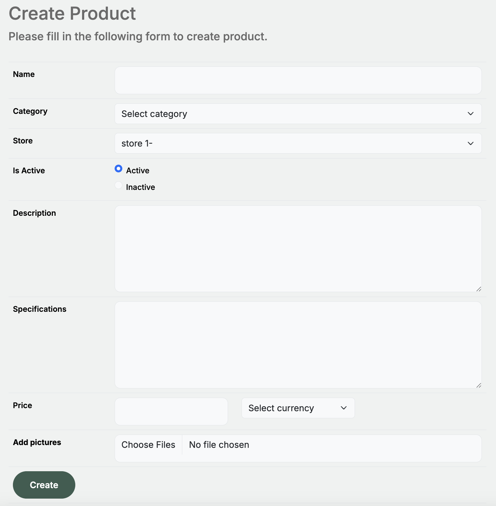

# Application Modules

## Account Management

There 3 types of users in the system:
- **System Administrator**: The system administrator is the owner of the system. 
  - He can create, update and delete categories.
  - He can view all stores and products.
- **Store owner**: The store owner is the owner of a store. 
  - He can create and update his store.
  - He can create, update and delete his products.
- **Regular user**: The regular user is a user who can view all stores and products.
  - He can create an account and log in to the system.
  - He can view his account and update his contact and address information.

### Registration

You may register to the platform by providing your email address and a password. 
You will receive a confirmation email to verify your account. 
Once verified, you can log in to the platform.
You may register as a `regular user` or as a `store owner`.

### Login

You may log in to the platform by providing your email address and password.

### Forgot Password

If you forget your password, you may reset it by providing your email address.

### Change Password

You may change your password by providing a new password.

### Manage Account

You may manage your account by viewing your account, updating your contact information and address information.

## Top Navigation

### Search
You may search the web site from top navigation by providing a keyword.

The search results will be displayed in a new page.

### My Account Menu 

#### Store Owner

If you're a **store owner**, you may view your account, orders, stores, products and change password by hovering the `My Account` link in the navigation bar.

#### Regular User

If you're a **regular user**, you may view your account, orders and change password by hovering the `My Account` link in the navigation bar.

### Change Language

You may change the language of the web site by clicking on the `Language` select box in the navigation bar.

## Store Management

The **store owner** may create, update, add products to his store.

### Create Store

You may create a store by providing a name.

### View Stores

You may view your stores by clicking on the `My Stores` link in the navigation bar.

### Update Store

You may update your store by providing a new name.

### Create Product

You may add a product to your store by providing a name, description, price and image.

### View Products

You may view your products by clicking on the `My Products` link in the navigation bar.

## Category Management

The **system administrator** may create, update and delete categories.
The **store owners** cannot do these operations.

### Create Category

You may create a category by providing a name, a parent category and a description.

### View Categories

You may view your categories by clicking on the `Categories` link in the navigation bar.

### Update Category

You may update your category by providing a new name, a new parent category and a new description.

### Delete Category

You may delete your category by clicking on the `Delete` button in the update category page.

### View Category Tree

You may view the category tree by clicking on the `Category Tree` link in the navigation bar.

## Shopping

You may navigate product categories and products by using the top navigation.

### Shopping Cart

You may add products to your cart by clicking on the `Add to Cart` button.

### Checkout

You may finish your shopping by clicking on the `Checkout` button.

### My Orders

You may view your orders by clicking on the `My Orders` link in the navigation bar.

If your are not logged in, you may enter your order number to view your order.

### Order Details

Then you may view your order details.

### Review Order Products

You may also review the products in your order by clicking on the `Review` buttons on the order details page.

